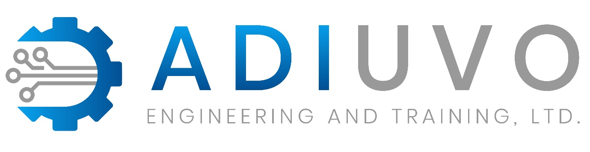

.. _testimonials:

Testimonials
============

Professionals
-------------

.. raw:: html

    
<em><strong>"Adiuvo specialises in the development of FPGAs for space and other mission critical applications, over the last 12 months our editor of choice has become VSCode with the TerosHDL add in. FPGA developed for space and mission critical applications require not only a high quality of code but also detailed and correct supporting documentation. </strong></em>

    
<em><strong>Using the TerosHDL add in we are able to include timing and register information within the RTL source code. The documentation features of TerosHDL then enable the creation of waveform diagrams, register maps, Block IP Block diagrams demonstrating interfaces along with of course FSM diagrams. These documentation features support developers as they create the supporting design documentation and design descriptions for design and certification reviews"</strong> </em>

    
- Adam Taylor,

    
Founder Adiuvo Engineering / Author MicroZed Chronicles.

    
&nbsp;

    
&nbsp;

    
&nbsp;

--------------------------------------------------------------------

.. raw:: html

   
<em><strong>"I have been using Teros HDL plugin in the last year and a half in a daily basis and I really think it helped me to increased my productivity. The Documentation and Finite State Machine (FSM) viewer are really useful features, that allow you to spend more time coding instead of documenting.</strong></em><em><strong>"</strong> </em>

   
- David Guzm&aacute;n Garc&iacute;a,

   
Associate Branch Head, Electro-Mechanical Systems Branch / NASA Goddard Space Flight Center.

   
&nbsp;

   
&nbsp;

   
&nbsp;

--------------------------------------------------------------------

.. raw:: html

   
<em><strong>"This is an excellent IDE for writing in HDL languages, it works flawlessly and the documentation feature is very nicely integrated. Well done, keep up the great work!</strong></em><em><strong>"</strong> </em>

   
- Glenn Kirilow,

   
Technical Leader / Seeing Machines.

   
&nbsp;

   
&nbsp;

   
&nbsp;

--------------------------------------------------------------------

.. raw:: html

   
<strong><em>"</em>CAEN produces boards and system mainly for physics reasearch facilities and laboratories. FPGA is a key component in the development of digitizer boards.</strong>

   
<strong>TersoHDL is a key tool to work with HDL source code (VHDL in our case). We highly appreciate features like template generation, design documentation (wavedrom, state machine diagrams, module documentation) among others.</strong> <strong>The project is open-sourced and the development team is very responsive. It is also highly involved in the VHDL/Verilog community (VUnit, GHDL, Yosys, OSVVM).</strong>

   
<strong>Great evolving tool!<em>" </em></strong>

   
- Luca Colombini,

   
CAEN staff / Senior design engineer.

   
&nbsp;

   
&nbsp;

   
&nbsp;
