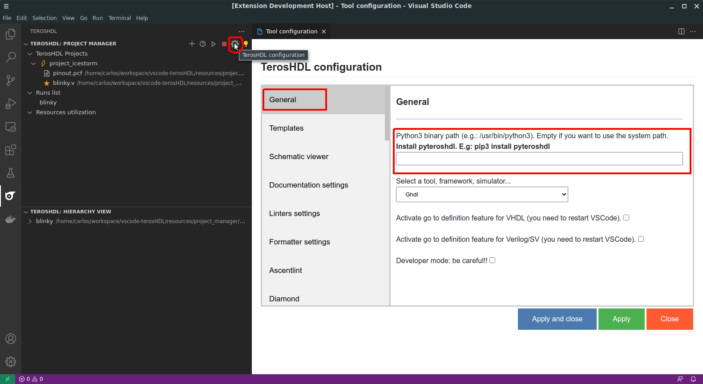

.. _python:

Python 3
========

Python 3 is automatically usable by TerosHDL if it’s in your system path. But a custom path can be configures 
if it’s not the case. You need the provide the complete path Python (included binary).

Python 3 in system path
----------------------

You don't need to configure it.

Example custom path in Linux
-----------------------------

``/home/teroshdl/custom/python3``

Example ustom path in Windows
-----------------------------

Be careful with the blank spaces.

``C:\Users\Ron\AppData\Local\Programs\Python\Python37-32``

Example with Anaconda
---------------------

``conda activate my_en;``

**If you use Windows you have to replace ';' by '&'**

Example with virtualenv
-----------------------

``source .venv/bin/activate; python3``

**If you use Windows you have to replace ';' by '&'**
