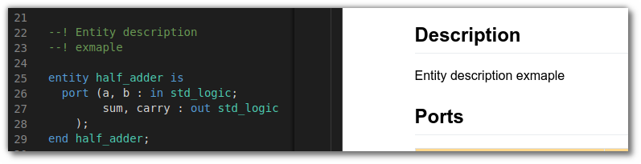
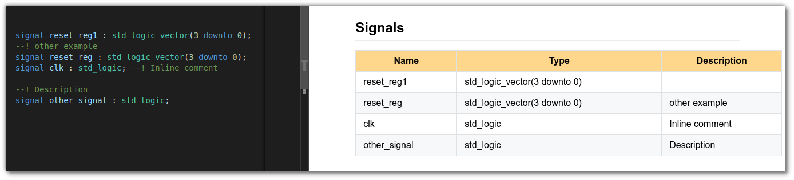
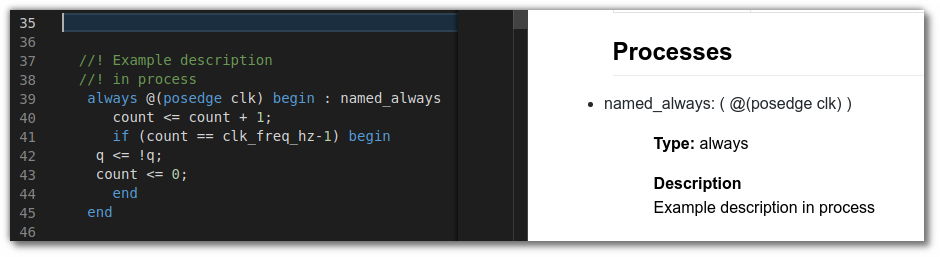
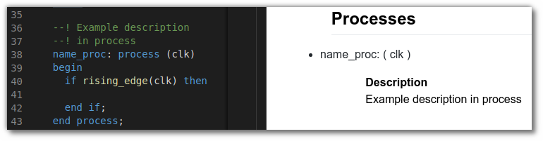

.. _supported_hdl_labels:

Supported HDL labels
====================

.. csv-table:: Supported HDL labels
    :header: "VHDL", "Verilog/SV"
    :widths: auto
    :align: center

    "Entity description", "Module description"
    "Ports", "Ports"
    "Generics", "Parameters"
    "Constants", "Constants"
    "Signals", "regs/wires"
    "Processes", "Always"
    "Instances", "Instances"
    "Functions", "Functions"
    "Types", "Types"

Entity/module description
-------------------------

Ports
-----

Generics/parameters
-------------------

Constants
---------

Signals
-------

Processes/always
----------------

Instances
---------

Functions
---------

Types
-----
