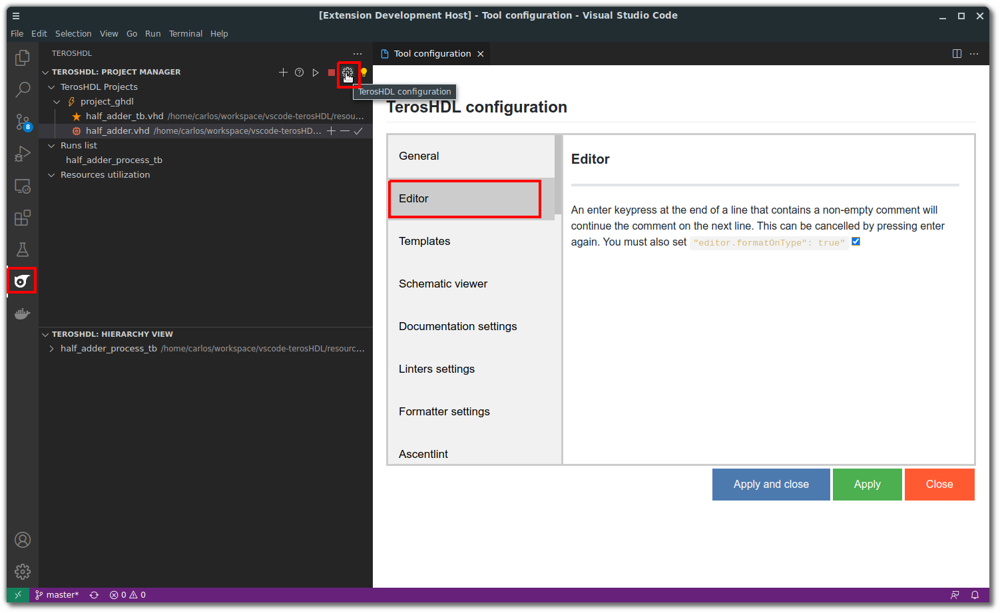
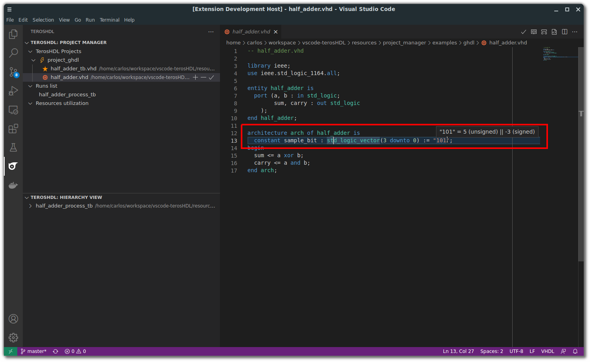
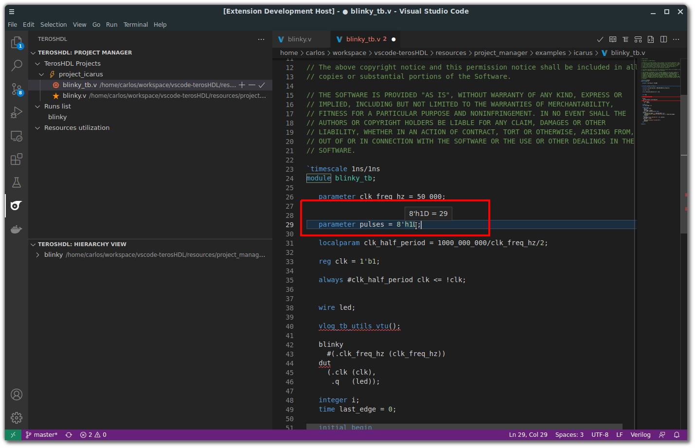

.. _editor_features:

Features
========

Configuration
-------------




Continue comments
-----------------

An enter keypress at the end of a line that contains a non-empty comment will continue the comment on the next line. This can be cancelled by pressing enter again.
You must also set ```"editor.formatOnType": true``` to enable live replacement of text as you type.

Number hover
------------

Hover a number, a preview of the value in signed/unsigned will appear. 





