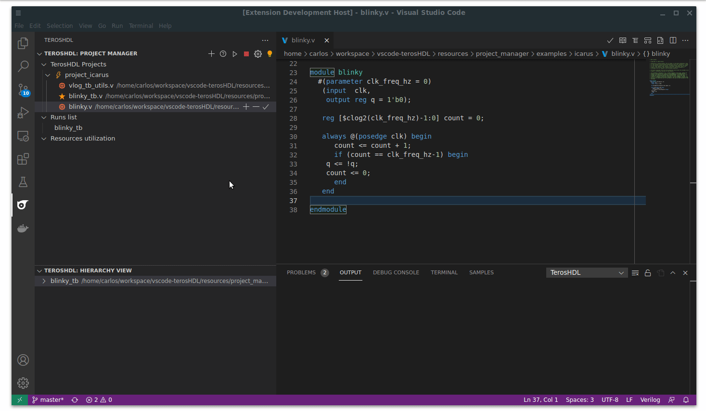

.. _go_to_parent:

Go to parent entity
===================

If you press ``Alt + Backspace`` (Linux/Windows) or ``Command + Delete`` TerosHDL will open the parent file of your current design. 
You need (:ref:`an active project<hiterachy_project_manager>`)

