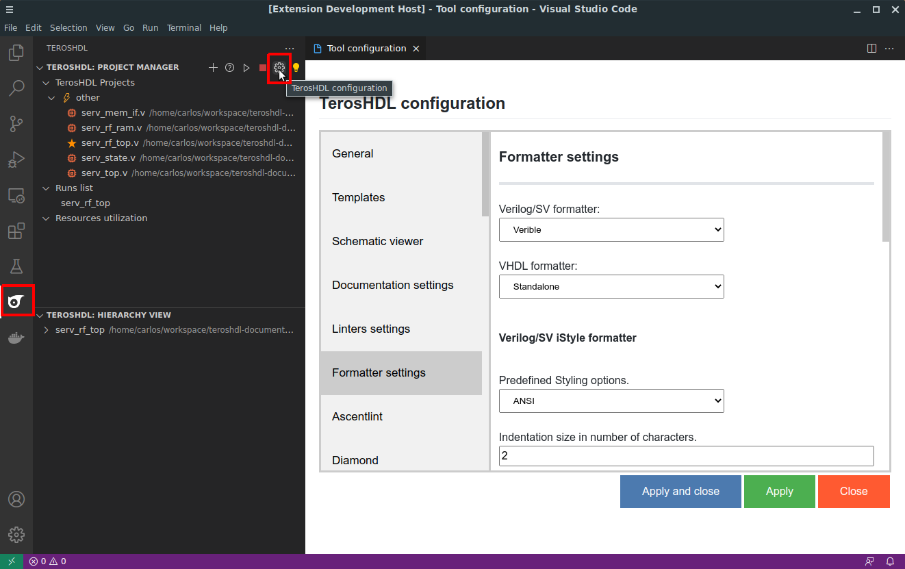

.. _configuration_formatting:

Configuration
=============

.. csv-table:: Supported formatters
    :header: "Formatter", "Language", "Requeriments"
    :widths: auto
    :align: center

    "iStyle", "Verilog/SV", "None"  
    "s3sv", "Verilog/SV", "Python 3"
    "Verible", "Verilog/SV", "Verible binary"
    "Standalone", "VHDL", "None"

You can download Verible binary from: https://github.com/chipsalliance/verible/releases

Open TerosHDL configuration panel and cofigure the formatter:

