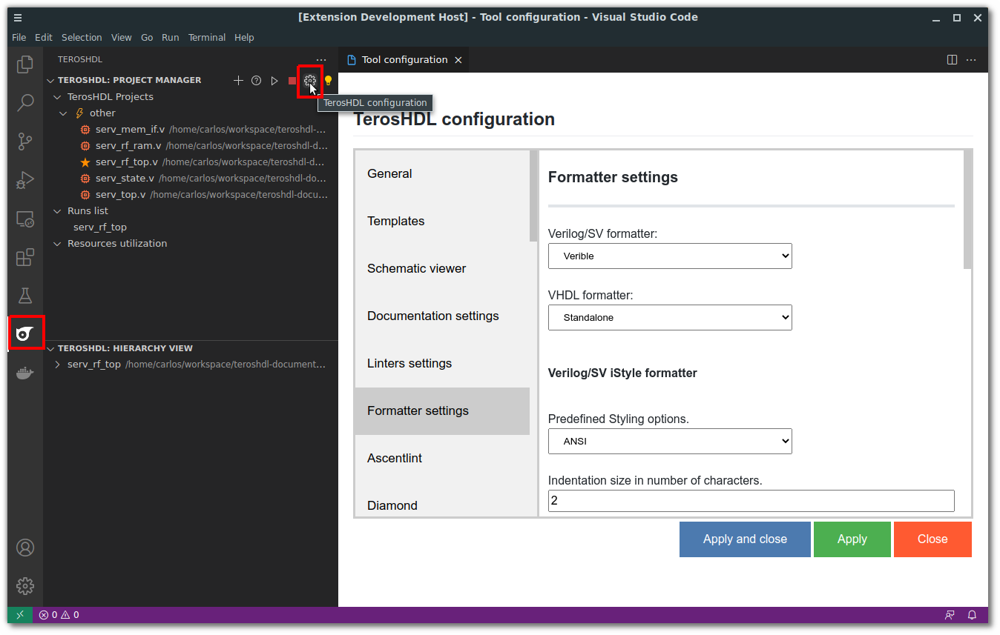

.. _configuration_formatting:

Configuration
=============

Open TerosHDL configuration panel and cofigure the formatter:

.. csv-table:: Supported formatters
    :header: "Formatter", "Language", "Requeriments"
    :widths: auto
    :align: center

    "iStyle", "Verilog/SV", "None"  
    "s3sv", "Verilog/SV", "Python 3"
    "Verible", "Verilog/SV", "Verible binary"
    "Standalone", "VHDL", "None"
    "Standalone", "VHDL", "Python3 and VSG package"

.. important::

    Download Verible from: https://github.com/chipsalliance/verible/releases

.. important::

    Make sure Python 3 path is configured in TerosHDL.

VSG (VHDL Style Guide)
-----------------------

VHDL Style Guide (VSG) provides coding style guide enforcement for VHDL code. You can check the full documentation:
https://vhdl-style-guide.readthedocs.io/en/latest/index.html

You need to configure Python 3 and install VSG python package. 

