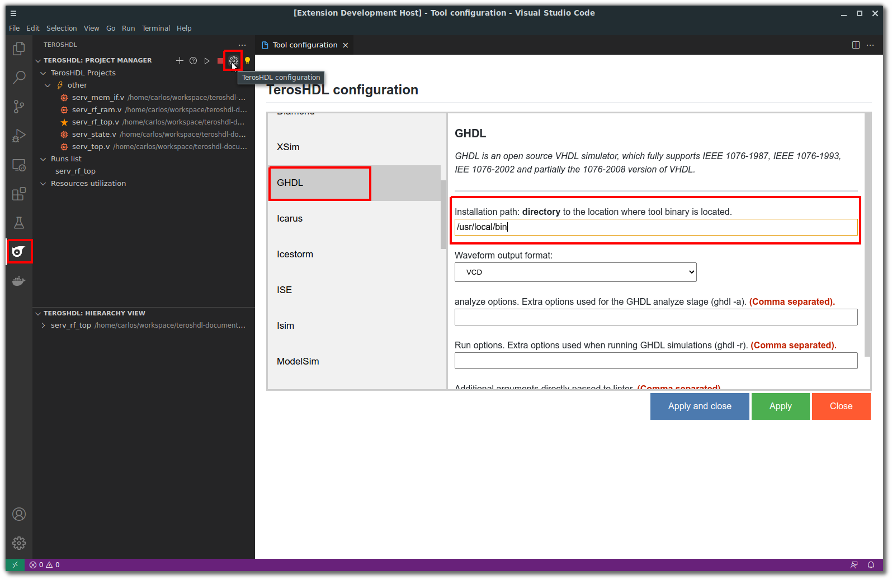

.. _configuration_linter:

Configuration
=============

Tool selection
--------------

Open TerosHDL configuration panel and select your linter:

.. image:: images/configuration.png

.. important::

    If your linter (Vivado, GHDL, Icarus...) is in the system path (you can call it from command line) you don't need to set the installation directory.

Tool path
---------

You don't need to configure the installation path if the tool is in the system path (you are allowed to launch it from
command line). Otherwise you need to set the installation path: folder where is located the tool binary.

Only the folder, not folder and binary name. E.g:

- ModelSim in Linux: /opt/intelFPGA_pro/20.1/modelsim_ase/bin
- GHDL in Linux: /usr/local/bin/

Make sure that the tool binary is located in the folder.

Additional linter arguments
---------------------------

Configure additional arguments passed to the linter:

