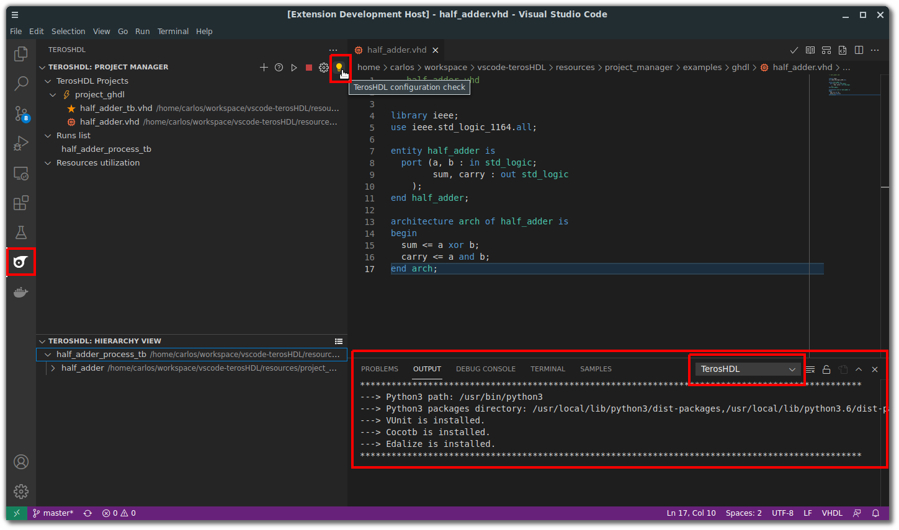

.. _configuration_project_manager:

Configuration
=============

Python 3
--------

- Install Python 3 requirements (:ref:`check the requirements section<requirements>`)
- Configure you Python 3 path (:ref:`check the configuration section<python>`)

Tools: simulators and others
----------------------------

:ref:`Go to tools settings.<tools>`

Project documentation
---------------------

:ref:`Go to documentation settings.<configuration_documenter>`

Check your configuration
-------------------------

