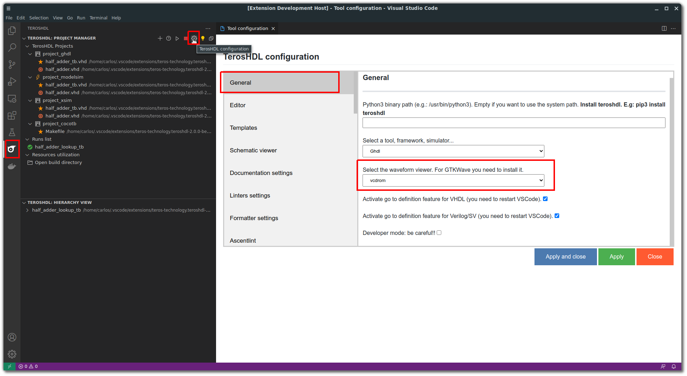
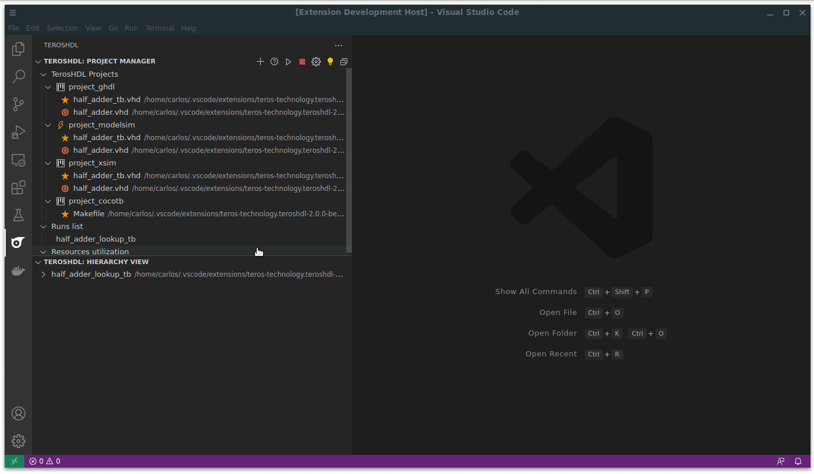

.. _gui_project_manager:

GUI mode
========

.. csv-table:: Supported tools in GUI mode
    :header: "Supported tools in GUI mode"
    :widths: auto
    :align: center

    "GHDL"  

Configuration
-------------

You can choose your favourite waveform viewer from TerosHDL configurartion. VCDrom is included in the IDE.

Getting started
---------------

