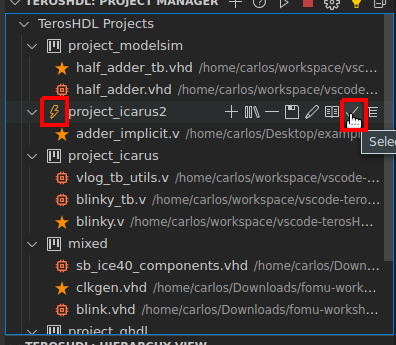

.. _troubleshooting:

Troubleshooting
===============

- Is there one project selected?

- Have you selected the top level in your project?
    - For VUnit the top level is your run.py
    - For cocotb the top level is your makefile.

- Is python 3 configured?
- Have you installed the Python packages? (:ref:`check the configuration section<python>`)
- Have you installed the make tool? (:ref:`check the configuration section<requirements>`)

- Is your tool (Vivado, GHDL, ModelSim...) selected in the configuration? Check the configuration section. (:ref:`check the configuration section<tools>`)

