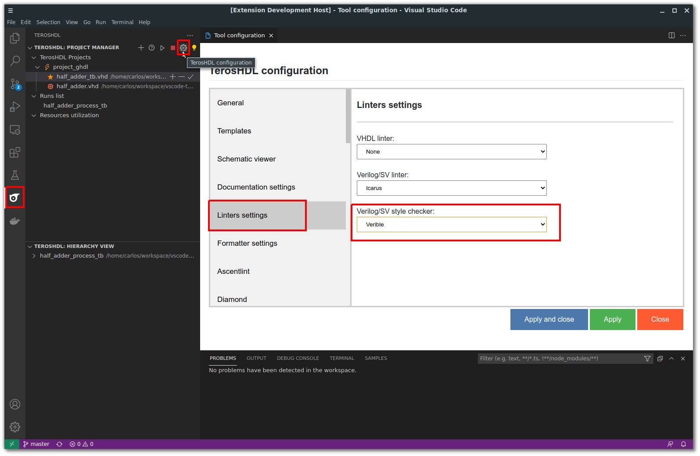
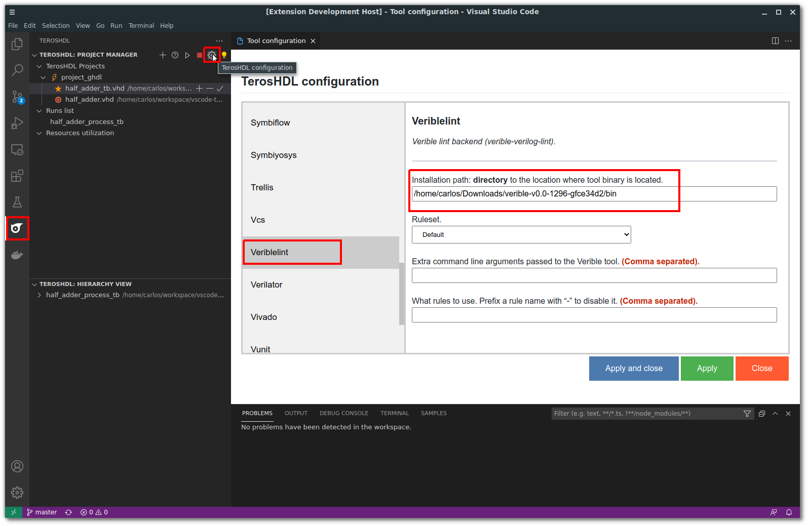

.. _configuration_style:

Configuration
=============

Open TerosHDL configuration panel and select your style checker:

.. important::

    If your style checker (Verible...) is in the system path (you can call it from command line) you don't need to set the installation directory.

.. important::

    Download Verible from: https://github.com/chipsalliance/verible/releases

Configure the installation **directory** of your selected style checker. For example, if you are using Verible:

VSG (VHDL Style Guide)
-----------------------

VHDL Style Guide (VSG) provides coding style guide enforcement for VHDL code. You can check the full documentation:
https://vhdl-style-guide.readthedocs.io/en/latest/index.html

You need to configure Python 3 and install VSG python package.

You can configure a rules file. Check the documentation: https://vhdl-style-guide.readthedocs.io/en/latest/configuring.html#file-list

.. image:: images/vsg_0.png