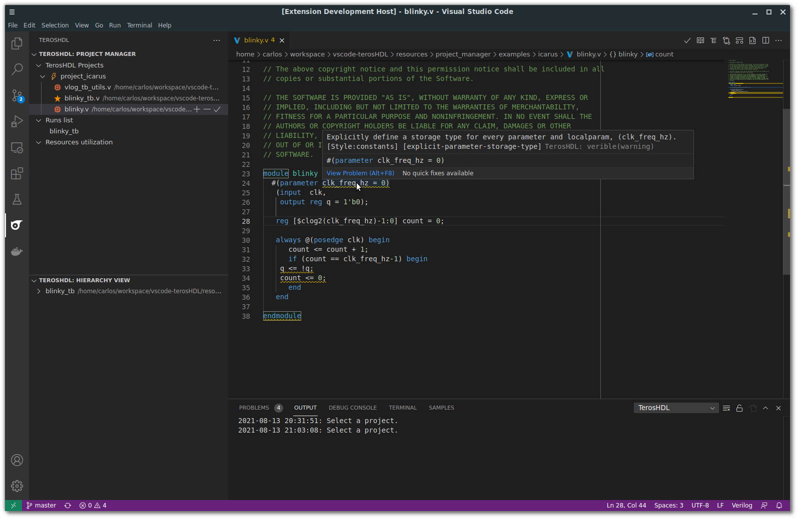

.. _start_style:

Getting started
===============

The style checker will show the errors in your code.

VSG (VHDL Style Guide)
-----------------------

TerosHDL shows the style rules violations:

.. image:: images/vsg_1.png

If you click in the Quick Fix button you can choose how to fix the style rule violation:

.. image:: images/vsg_2.png

