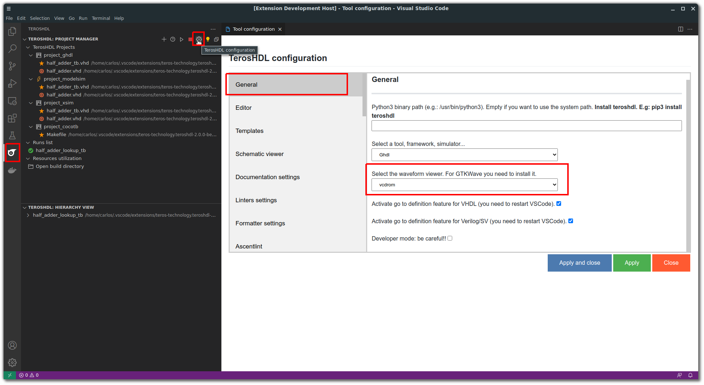
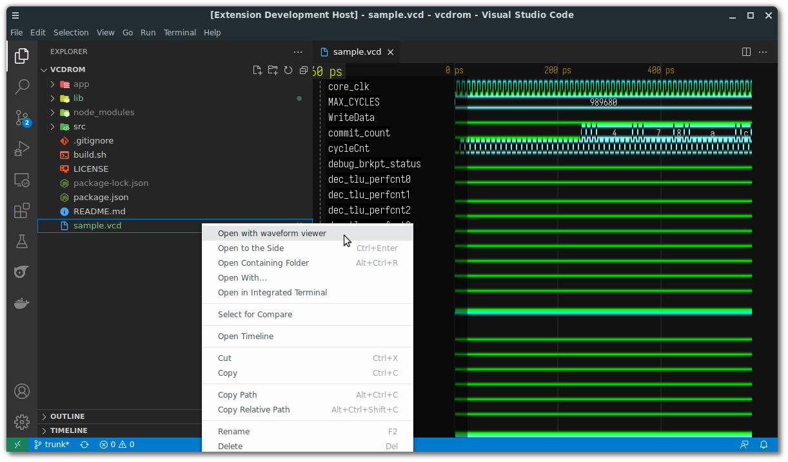
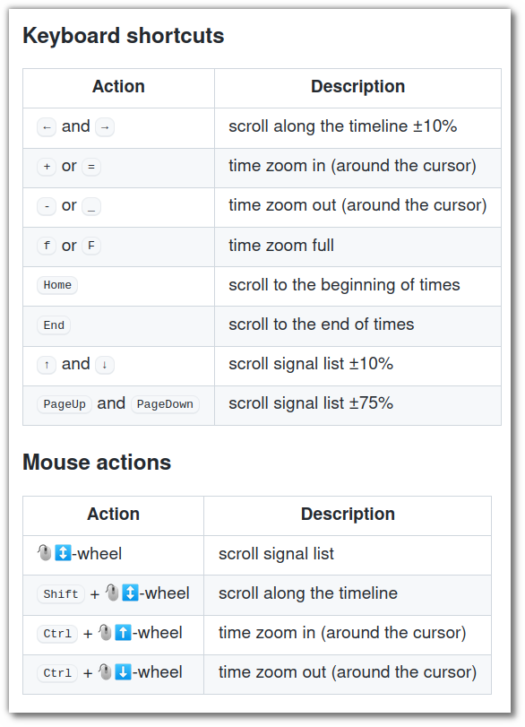

.. _waveform:

Waveform viewer
===============

You can open a VCD (waveform format) file from TerosHDL.

Configuration
-------------

VCDrom is embedded in TerosHDL, for GTKWAve you need to install it.

Getting started
---------------

In the file explorer click right in the VCD file:

VCDrom controls
---------------

