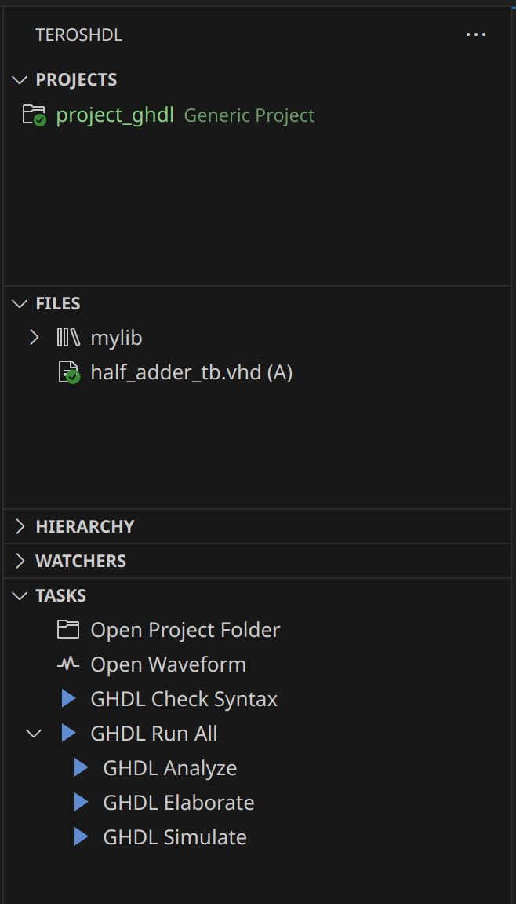
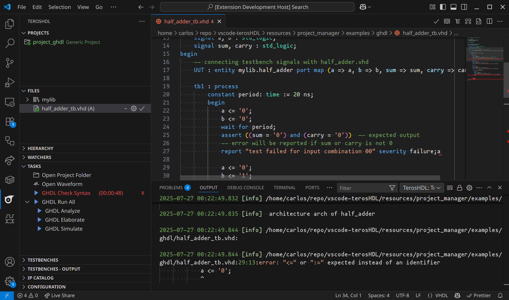
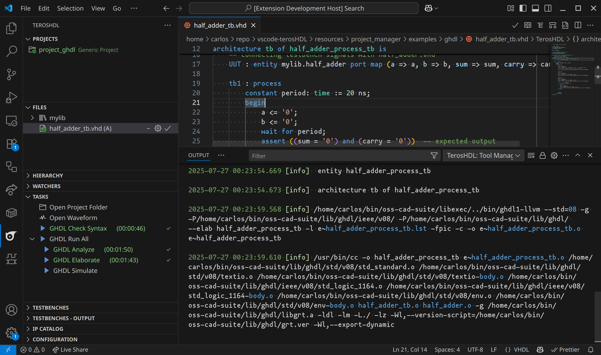
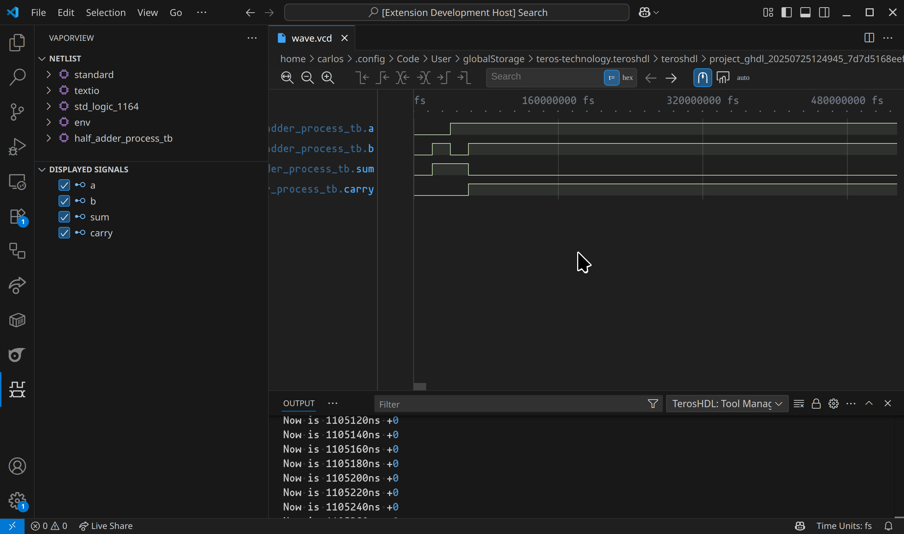
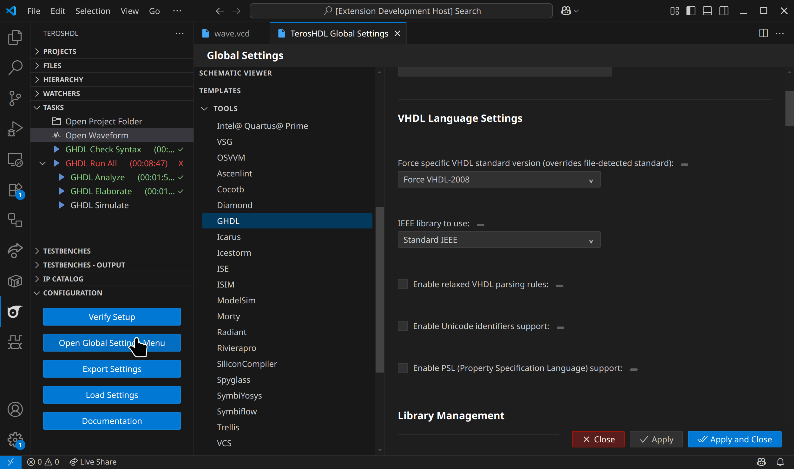

# GHDL

TerosHDL provides comprehensive integration with GHDL (GHDL VHDL compiler and simulator), offering both configuration options and automated tasks for VHDL development. This guide explains how to use GHDL effectively within TerosHDL.

## Table of Contents

- [Overview](#overview)
- [Getting Started](#getting-started)
- [Tasks](#tasks)
  - [GHDL Check Syntax](#ghdl-check-syntax)
  - [GHDL Run All](#ghdl-run-all)
  - [Individual Tasks](#individual-tasks)
- [Understanding the Workflow](#understanding-the-workflow)
- [Configuration Options](#configuration-options)
- [Usage Examples](#usage-examples)
- [Troubleshooting](#troubleshooting)

## Overview

GHDL is a free and open-source VHDL compiler and simulator. TerosHDL integrates GHDL to provide a complete VHDL development environment with:

- **Syntax checking** without code generation
- **Analysis and compilation** of VHDL files
- **Elaboration** of designs
- **Simulation** with automatic waveform generation
- **Comprehensive configuration** options



## Getting Started

1. **Install GHDL** on your system or specify the installation path in TerosHDL settings
2. **Create or open a VHDL project** in TerosHDL
3. **Add your VHDL files** to the project
4. **Specify the top-level entity** for simulation
5. **Use the tasks** to compile and simulate your design

## Tasks

TerosHDL provides several GHDL tasks accessible through the Tasks panel. These tasks automate the VHDL development workflow from syntax checking to simulation.

### GHDL Check Syntax

**What it does**: Performs fast syntax checking of your VHDL files without generating any code or updating libraries.

**When to use**:
- Before starting compilation to catch syntax errors early
- During development to quickly validate code changes
- When you want to check code without affecting your project libraries

**How it works**:
- Scans all VHDL files in your project
- Uses the VHDL standard detected from your files (or forces a specific one if configured)
- Groups files by their logical libraries
- Reports syntax errors immediately
- Does not generate any output files

**Benefits**:
- **Fast feedback** - much quicker than full compilation
- **Non-invasive** - doesn't modify your project libraries
- **Early error detection** - catch problems before simulation



### GHDL Run All

**What it does**: Executes the complete VHDL workflow from compilation to simulation in the correct order.

**When to use**:
- When you want to compile and simulate your complete design
- For final testing before deployment
- When you need waveform output for debugging

**The workflow includes three sequential steps**:

#### 1. GHDL Analyze
**Purpose**: Compiles VHDL files and builds/updates the library database.

**What happens**:
- Processes files grouped by logical library
- Compiles each file and checks for errors
- Updates the library database with compiled entities, architectures, and packages
- Ensures all dependencies are properly analyzed

#### 2. GHDL Elaborate
**Purpose**: Links the design and prepares it for simulation.

**What happens**:
- Takes your top-level entity and traces all its dependencies
- Resolves all component instantiations and port mappings
- Creates an executable simulation model
- Performs binding checks and optimizations

#### 3. GHDL Simulate
**Purpose**: Runs the actual simulation and generates results.

**What happens**:
- **Automatically removes old waveform files** (`wave.*`) to ensure clean results
- Executes the simulation with your configured time limits
- Generates waveform files in your chosen format (VCD, GHW, or FST)
- Applies all run-time options and signal tracing



### Individual Tasks

You can also run the components of "GHDL Run All" individually:

#### GHDL Analyze (Standalone)
Run only the analysis/compilation step. Useful when:
- You want to check compilation without simulation
- You're working on library packages that other files depend on
- You need to update libraries after code changes

#### GHDL Elaborate (Standalone)
Run only the elaboration step. Useful when:
- Analysis is already complete
- You want to test design binding without simulation
- You're debugging elaboration-specific issues

#### GHDL Simulate (Standalone)
Run only the simulation step. Useful when:
- Analysis and elaboration are already complete
- You want to re-run simulation with different parameters
- You're experimenting with different simulation settings

#### Open Waveform
**Purpose**: Opens the generated waveform files in your configured viewer.

**What it does**:
- Searches for waveform files (`.vcd`, `.ghw`, `.fst`) in the project directory
- Opens the found waveform files using your configured viewer
- Provides easy access to simulation results

**When to use**:
- After running a simulation to view waveform results
- To re-open waveform files from previous simulations
- When you want to analyze timing and signal behavior

**Supported viewers**:
- **GTKWave** - External professional waveform viewer
- **VaporView** - VS Code extension for waveform viewing
- **Built-in tool viewers** - When available

**Supported formats**: GHW, VCD, FST



## Understanding the Workflow

### The VHDL Development Cycle

```
1. Write/Edit VHDL Code
   ↓
2. Check Syntax (optional but recommended)
   ↓
3. Analyze → Elaborate → Simulate
   ↓
4. View Waveforms
   ↓
5. Debug and Iterate
```

### When to Use Each Task

| Task | Use Case | Speed | Output |
|------|----------|-------|---------|
| **Check Syntax** | Quick validation during development | Very Fast | Error reports only |
| **Analyze** | After code changes, library updates | Fast | Updated libraries |
| **Elaborate** | Test design binding and connectivity | Fast | Simulation model |
| **Simulate** | Generate results and waveforms | Moderate | Waveforms, logs |
| **Run All** | Complete workflow, final testing | Full time | Complete results |
c
## Configuration Options

All GHDL settings are accessible through TerosHDL's configuration interface.



### Basic Configuration

**Installation Path**: Specify where GHDL is installed on your system
- Leave empty to use system PATH
- Required if GHDL is not in your system PATH

### VHDL Language Settings

**VHDL Standard Version**: Control which VHDL standard to use
- `Auto-detect from file`: Automatically detect from your VHDL files (recommended)
- `Force VHDL-87/93/2002/2008/2019`: Override with specific standard

**IEEE Library**: Choose IEEE library implementation
- `Standard IEEE`: Standard IEEE implementation
- `Synopsys IEEE`: Synopsys IEEE implementation

**Relaxed Parsing**: Enable more lenient VHDL parsing rules

**Unicode Support**: Allow Unicode identifiers in your VHDL code

**PSL Support**: Enable Property Specification Language features

### Library Management

**Work Library**: Name of the default working library (usually "work")

**Library Paths**: Additional directories to search for VHDL libraries

### Stage-Specific Options

**Check Syntax Options**: Additional flags for syntax checking (`ghdl -s`)

**Analyze Options**: Extra options for compilation (`ghdl -a`)

**Elaborate Options**: Additional flags for elaboration (`ghdl -e`)

**Run Options**: Simulation parameters (`ghdl -r`)

**Synthesis Options**: Options for synthesis (`ghdl --synth`)

### Simulation Settings

**Simulation Time**: Set maximum simulation time (e.g., "1ms", "500ns")

**Resolution Limit**: Set time precision (e.g., "1ps", "1ns")

**Stack Size**: Memory allocation for simulation

**Stop Delta Cycles**: Limit delta cycle iterations

### Waveform Output

**Waveform Enabled**: Enable/disable waveform generation

**Waveform Format**: Choose output format
- `VCD`: Value Change Dump (widely supported)
- `GHW`: GHDL native format (most detailed)
- `FST`: Fast Signal Database (compact)

**Waveform Options**: Additional waveform generation parameters

**Advanced Waveform Settings**:
- Wave start time recording
- VCD 4-state format
- Signal filtering options
- Custom wave option files

### Debug and Analysis

**Debug Level**: Control amount of debug information
- `No debug info`: Fastest execution
- `Minimal debug info`: Basic information
- `Full debug info`: Detailed debugging

**Verbose Output**: Enable detailed command output

### Error and Warning Handling

**Warnings as Errors**: Treat warnings as compilation errors

**Suppress Warnings**: Specify warning types to ignore

### Assertions and Verification

**Assert Level**: Control assertion sensitivity
- `Note/Warning/Error/Failure level`: Different sensitivity levels
- `Disable assertions`: Turn off assertion checking

**Display Options**: Show timing and delta cycle information

**Backtrace Settings**: Control error backtrace generation

### IEEE Standards Compliance

**IEEE Asserts**: Control IEEE assertion handling

**Asserts Policy**: Policy for handling assertions during simulation

### Advanced Features

**File I/O and External Interfaces**:
- SDF file support for timing annotation
- VPI/VHPI module loading
- External trace file generation
- PSL reporting options

**Display and Hierarchy**:
- Design hierarchy display options
- Signal and port visualization
- Process and instance information

## Usage Examples

### Basic Workflow Example

1. **Setup your project**:
   - Ensure GHDL is installed and configured
   - Add your VHDL files to the project
   - Set the top-level entity

2. **Quick syntax check**:
   - Run "GHDL Check Syntax" to catch any syntax errors
   - Fix any reported issues

3. **Full simulation**:
   - Run "GHDL Run All" to compile and simulate
   - Wait for completion (monitor progress in Tasks panel)

4. **View results**:
   - Click "Open Waveform" to view simulation results
   - Analyze signals and timing in the waveform viewer


## Troubleshooting

### Common Issues and Solutions

#### GHDL Not Found
**Problem**: Error message "ghdl: command not found"
**Solutions**:
- Install GHDL on your system
- Add GHDL to your system PATH
- Set the correct installation path in TerosHDL configuration

#### No Top-Level Entity
**Problem**: "No top level entity specified"
**Solutions**:
- Specify the top-level entity in your project settings
- Ensure the entity name exactly matches your VHDL file
- Check that the entity is properly declared

#### Compilation Errors
**Problem**: Analysis or elaboration fails
**Solutions**:
- Run "GHDL Check Syntax" first to identify syntax issues
- Verify VHDL standard settings match your code
- Check library dependencies and include paths

#### No Waveform Generated
**Problem**: Simulation completes but no waveform file appears
**Solutions**:
- Enable "Waveform Enabled" in configuration
- Check "Run Options" for waveform generation parameters
- Verify simulation actually ran (check for error messages)
- Ensure you have write permissions in the project directory

#### Library Issues
**Problem**: "Library not found" errors
**Solutions**:
- Check library path configuration
- Verify library directory structure
- Ensure all required libraries are properly compiled
- Check file library assignments

### Performance Tips

1. **Use syntax checking** during development to catch errors early
2. **Enable appropriate debug level** (minimal for faster execution)
3. **Set reasonable simulation time limits** for large designs
4. **Use efficient waveform formats** (FST for large simulations)
5. **Organize libraries efficiently** to minimize compilation time

### Getting Help

- **Check the terminal output** for detailed error messages and warnings
- **Use verbose mode** for more diagnostic information
- **Start with simple examples** to verify your setup
- **Check GHDL documentation** for command-line option details

---

## Additional Resources

- [GHDL Official Documentation](https://ghdl.readthedocs.io/)
- [GTKWave User Guide](http://gtkwave.sourceforge.net/)

