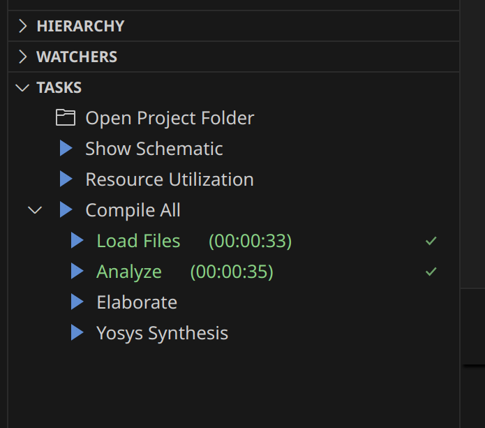
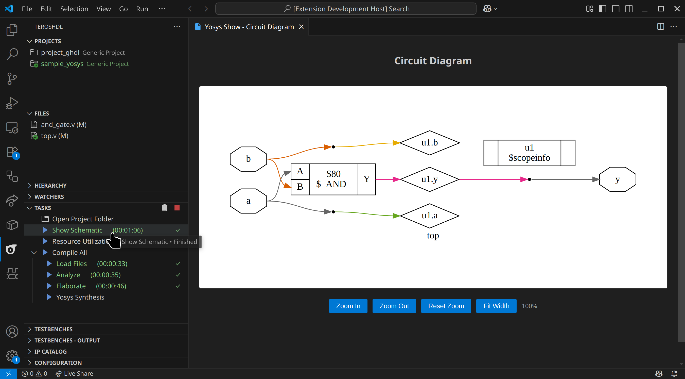
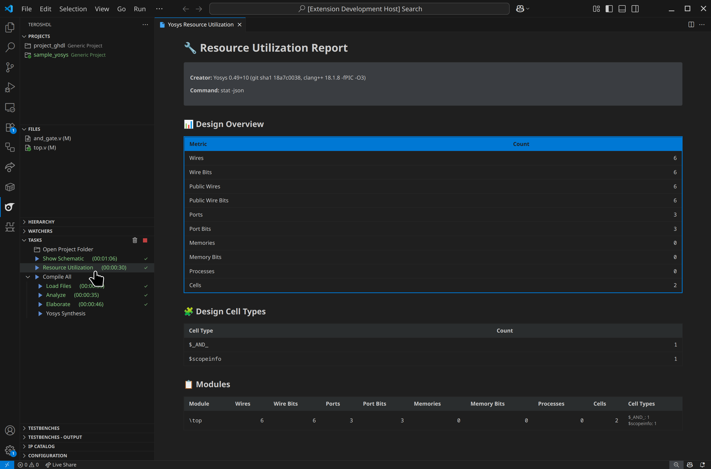
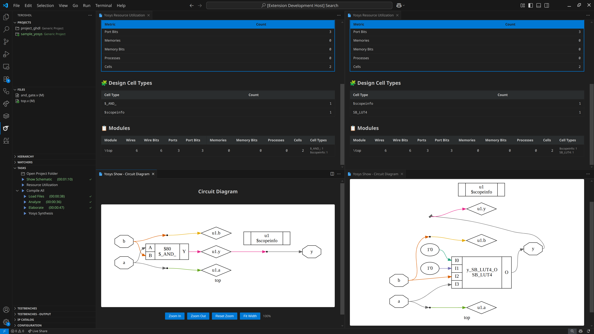

# Yosys

## Table of Contents
1. [Introduction](#introduction)
2. [Project Setup](#project-setup)
3. [Yosys Tasks Overview](#yosys-tasks-overview)
4. [Using the Show Feature](#using-the-show-feature)
5. [Resource Utilization Analysis](#resource-utilization-analysis)
6. [Workflow: Changing Configuration Between Stages](#workflow-changing-configuration-between-stages)
7. [Saving Design Between Stages](#saving-design-between-stages)
8. [Important Yosys Configuration Options](#important-yosys-configuration-options)

## Introduction

Yosys is an open-source RTL synthesis framework that TerosHDL integrates seamlessly. This guide explains how to use Yosys within TerosHDL to synthesize your Verilog and SystemVerilog designs, visualize circuits, and analyze resource utilization.

:::warning

**Current Language Support**: This integration currently supports Verilog and SystemVerilog only. VHDL support is not available in the current implementation.

:::

## Project Setup

### Adding Source Files

1. **Create a new TerosHDL project** or open an existing one
2. **Add your HDL source files** to the project:
   - Select "Add files"
   - **Note**: VHDL is not currently supported by the Yosys integration
3. **Selecting the Top Levels**:
   - Click in the tick icon next to the top-level module in Sources View

## Yosys Tasks Overview

TerosHDL provides several Yosys tasks that follow the typical synthesis workflow:

### 1. Compile All
- **Purpose**: Run all the stages

### 2. Load Files
- **Purpose**: Loads the compiled files into Yosys memory
- **What it does**:
  - Reads the parsed Verilog/SystemVerilog files into Yosys
  - Creates an internal representation of your design

### 3. Analyze
- **Purpose**: Analyzes the design for structural issues
- **What it does**:
  - Performs design rule checks
  - Identifies potential issues like unconnected signals
  - Analyzes the design hierarchy and dependencies

### 4. Elaborate
- **Purpose**: Expands the design hierarchy and resolves all references
- **What it does**:
  - Instantiates all modules and resolves parameters
  - Flattens the design hierarchy if needed
  - Resolves all signal connections and port mappings

### 5. Synthesis
- **Purpose**: Performs RTL synthesis to generate a gate-level netlist
- **What it does**:
  - Converts RTL code to logic gates
  - Maps to target technology (if specified)
  - Generates the final synthesized netlist

## Show Schematic

The Show feature generates and displays a visual schematic of your design:

### How to Use Show Schematic
1. **Complete at least the Elaborate task** (recommended after Synthesis for best results)
2. **Run the Show task**:
   - Go to the Tasks panel
   - Click on "Show Schematic" under Yosys tasks
   - Wait for the task to complete

3. **View the schematic**:
   - A webview will open displaying the circuit diagram
   - Use zoom controls to navigate the schematic
   - The diagram shows logic gates, connections, and signal paths

### Troubleshooting Show Schematic
- **Empty diagram**: Ensure your design has been elaborated or synthesized
- **No webview appears**: Check that the design contains synthesizable logic
- **Large designs**: May take time to render; be patient with complex circuits

## Resource Utilization Analysis

The Resource Utilization feature provides detailed statistics about your design:

### How to Use Resource Utilization
1. **Complete the Elaborate/Synthesis task** (required for accurate statistics)
2. **Run the Resource Utilization task**:
   - Go to the Tasks panel
   - Click on "Resource Utilization" under Yosys tasks
   - Wait for analysis to complete

3. **View the report**:
   - A webview opens with detailed tables
   - Review design overview and per-module statistics

### Report Contents

#### Design Overview Table
- **Wires**: Total number of wires in the design
- **Wire Bits**: Total number of individual wire bits
- **Ports**: Number of input/output ports
- **Port Bits**: Total bits in all ports
- **Memories**: Number of memory instances
- **Memory Bits**: Total memory capacity in bits
- **Processes**: Number of behavioral processes
- **Cells**: Total number of logic cells/gates

#### Module Breakdown Table
- Individual statistics for each module in your design
- Cell types breakdown showing specific gate types used
- Helps identify resource-heavy modules

#### Cell Types Table
- Detailed breakdown of logic gate types
- Shows optimization results and technology mapping

## Workflow: Changing Configuration Between Stages
You can modify your design and configuration between synthesis stages. You can also compare resource usage and schematics between stages. Here is an example comparing them between the Elaborate and Synthesis stages:

## Saving Design Between Stages

Yosys TerosHDL integration automatically saves design state between tasks.

### Automatic State Management
- TerosHDL automatically saves the design state after each task
- State files are stored in the project's build directory
- Each task can resume from the previous task's output

### Configuration Tips
- **Start with default settings** for initial experiments
- **Gradually adjust optimization** levels based on results
- **Use technology-specific synthesis** for FPGA targets
- **Enable verbose logging** for debugging synthesis issues