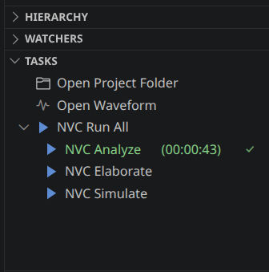
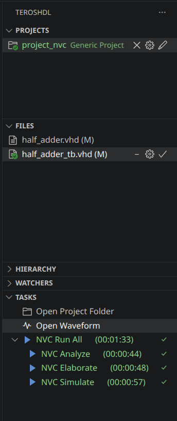
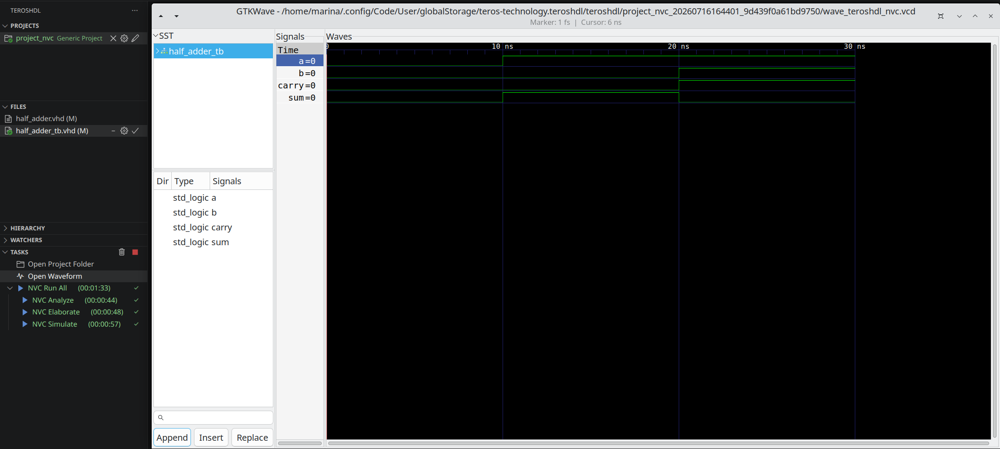

# NVC

## Table of Contents
1. [Introduction](#introduction)
2. [Project Setup](#project-setup)
3. [Open Waveform](#open-waveform)
4. [Simulation output](#simulation-output)
5. [Typical Simulation Workflow](#typical-simulation-workflow)

## Introduction

NVC is an open-source VHDL compiler and simulator. VHDL is a hardware description language used to describe and verify digital hardware designs such as FPGAs and ASICs.

NVC provides three main stages in the simulation flow:
    • **Analyze (nvc -a)**: Verify that the VHDL code is correct, checking their syntax and semantics.
    • **Elaborate (nvc -e)**: Build the design hierarchy, instantiate components, and prepares the designs for simulation.
    • **Simulate (nvc -r)**: Executes the elaborated design or testbench and can generate waveform files for debugging and verification.

NVC is similar to GHDL, another open-source VHDL simulator, but uses LLVM as its compilation backend, providing competitive performance.

## Project Setup

### Adding Source Files

1. **Create a new TerosHDL project** or open an existing one.
2. **Add your VHDL source files** to the project:
    - Select ***“Add files”***
3. **Selecting the top-level design**:
    - Click the checkmark icon next to the top-level entity in the Source View.
Note: The selected top-level entity is used by the Elaborate and Simulate tasks. 

### NVC Tasks Overview

TerosHDL provides several NVC tasks that follow the standard VHDL compilation and simulation workflow:

### 1. NVC Run All
- **Purpose**: Execute the complete NVC workflow.
- **What it does**:
    - Runs Analyze, Elaborate, and Simulate in sequence.
    - Stops the execution if any step reports an error.
    - Optionally generates a waveform file when waveform generation is enabled.
### 2. NVC Analyze
- **Purpose**: Analyze the VHDL source files.
- **What it does**:
    - Parses the VHDL source files.
    - Checks syntax and semantic correctness.
    - Compiles the design units into the selected working library.
    - Reports compilation errors and warnings.
### 3. NVC Elaborate
- **Purpose**: Prepare the design for simulation.
- **What it does**:
    - Builds the design hierarchy.
    - Resolves component instantiations and configurations.
    - Checks that all referenced design units are available.
    - Creates the executable simulation model.
### 4. NVC Simulate
- **Purpose** - Execute the simulation.
- **What it does**:
    - Runs the selected top-level testbench.
    - Executes the simulation.
    - Displays simulation messages in the terminal.
    - Generates waveform files when enabled.

## Open Waveform

A waveform is a graphical representation of the values of a design’s signals over time. During simulation, NVC records signal transitions into a waveform file.
The Open Waveform feature automatically opens this file in GTKWave, allowing you to inspect signal activity and verify the behavior of the design.

### How to use Open Waveform
- Enable waveform generation in the NVC configuration.
- Select the desired waveform format → ‘.vcd’, ‘.fst’, or ‘ ghw’.
- Complete the NVC Simulate task or run NVC Run All.
- Click Open Waveform in the panel.
- GTKWave will open automatically and load the generated waveform.

## Simulation Output

The ***Simulation Output** displays the messages generated by NVC while executing the simulation. It provides immediate feedback about the execution of the testbench and helps identify design errors without opening the waveform viewer.

### Output Information
The simulation output may include: 
- ***report*** statements generated by the VHDL design.
- ***assert*** failures and their severity.
- Warning and error messages.
- Simulation time information.
- Source file names and line numbers associated with each message.

The **Simulation Output** is useful for quickly validating the behavior of the design before inspecting the generated waveform.

## Typical Simulation Workflow

The NVC integration follows the standard VHDL simulation flow. After modifying the design or the testbench, the simulation can be rerun to verify the updated behavior.

A typical verification workflow consists of the following steps:
1. Edit the VHDL design or testbench.
2. Run Analyze to check the source files.
3. Run Elaborate to build the design hierarchy.
4. Run Simulate to execute the testbench.
5. Review the Simulation Output for reports, assertions, or errors.
6. If waveform generation is enabled, open the waveform in GTKWave to inspect signal activity.
7. Modify the design if necessary and repeat the process.